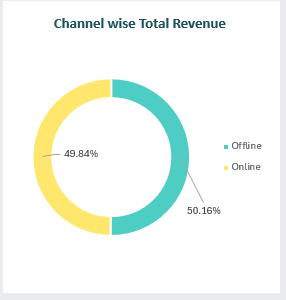
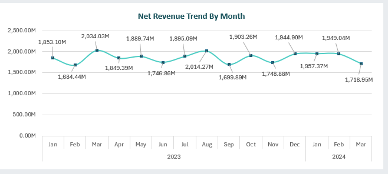
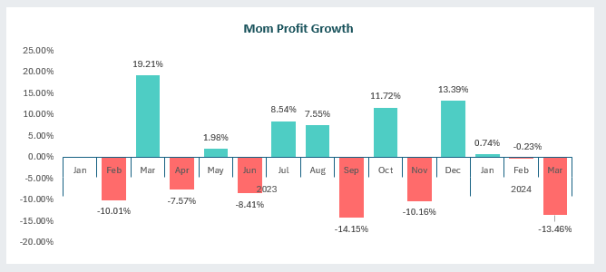
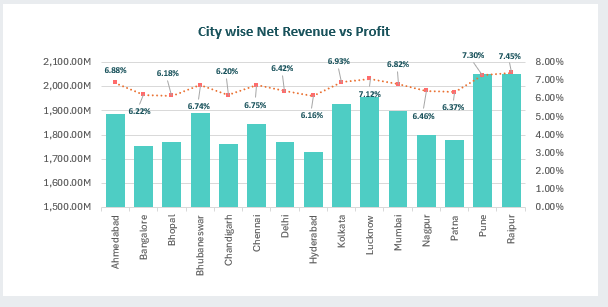
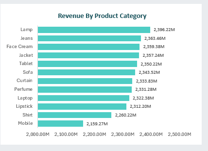
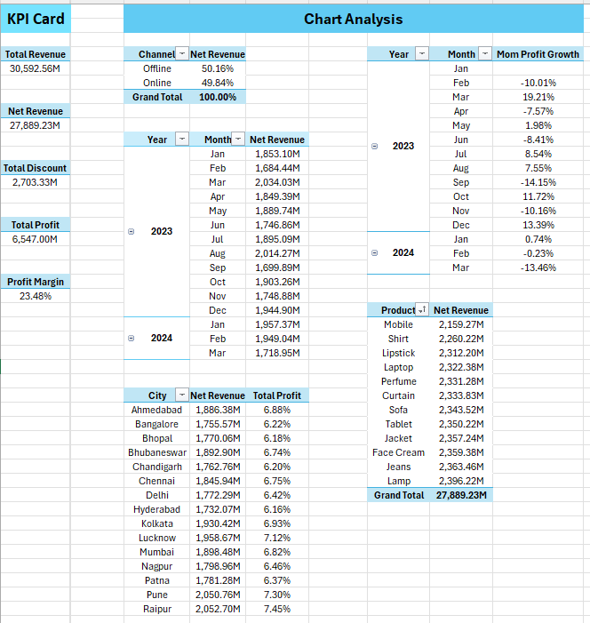
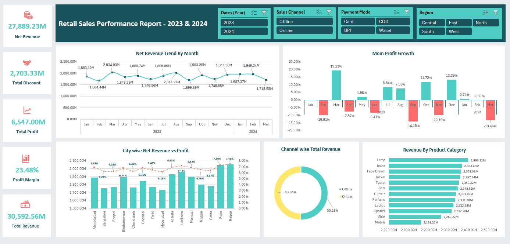

# 🧾 Retail Sales Performance Dashboard

## 📊 Project Overview

This project focuses on analyzing the retail sales performance of a company by examining various key performance indicators (KPIs) such as **revenue, profit margin, discount trends, and city/product-wise performance** using Excel.

- The objective is to help stakeholders understand:

- How different channels (Online/Offline) are contributing to revenue.

- Monthly performance trends.

- Profit growth rates (MoM).

- Which cities and products are the most profitable.

- Revenue distribution and margin efficiency.

## 📁 Dataset Information
The dataset includes the following key data points:

#### Main Table: master table

#### Supporting Dimension Tables:

- dim_customer: Customer details

- dim_city: City and Region info

- dim_channel: Sales channel (Online/Offline)

- dim_payment: Payment modes

- dim_product: Product details (Category & Sub-category)

## 📊 Method I Have Used in That Analysis

#### Microsoft Excel

- Pivot Tables

- Pivot Charts

- KPI Cards

- Conditional Formatting

- Calculated Fields

## 🧮 KPI Summary

Total Revenue - 30,592.56M

Net Revenue	-   27,889.23M

Total Discount - 	2,703.33M

Total Profit -	6,547.00M

Profit Margin -	23.48%

### 📈 Channel-wise Revenue Contribution

➡️ Offline slightly outperformed Online in terms of net revenue contribution.

### 📅 Monthly Net Revenue Trend (2023–2024)

The net revenue per month remained mostly stable **across 2023**, with noticeable peaks in **March 2023, August 2023, and December 2023.** However, a drop is seen in **March 2024**, indicating possible seasonal fluctuations or operational challenges.

Here are the clear chart to understand in a better way.

### 📈 Month-over-Month (MoM) Profit Growth (2023–2024)

**Profit growth varied significantly across months:**

- 📈 Highest growth: March 2023 **(+19.21%)**, October 2023 **(+11.72%)**

- 📉 Highest decline: September 2023 **(−14.15%)**, March 2024 **(−13.46%)**

These fluctuations suggest the need to analyze marketing strategies and operational costs.

### 🏙️ City-wise Performance

Top performing cities based on Net Revenue and Total Profit %:

#### ➡️ Raipur shows both high revenue and profitability, suggesting efficient operations and strong customer base.

### 🛍️ Product-wise Net Revenue

**Top products based on revenue:**

Lamp -	2,396.22M

Jeans -	2,363.46M

Face Cream  -	2,359.38M

Here are the clear visualization to better understand.

#### ➡️ Lamp is the highest revenue-generating product, possibly due to higher demand or price point.

### Pivot Report 

### Final Dashboard

## 🔍 Final Insights

- 📊 Balanced Channel Performance: **Both Online and Offline** channels contributed almost equally to revenue, offering flexibility in sales strategy.

- 🚀 Top Revenue Months: **March and August 202**3 were strong revenue months; sales campaigns could be studied and replicated.

- 🔻 Profit Volatility: Notable dips in **September 2023 and March 2024** indicate cost inefficiencies or reduced sales effectiveness during these periods.

- 🌆 **Raipur and Pune** stand out in both net revenue and profit % – good models for expansion or strategy replication.

- 🧴 High-performing products like **Lamp, Jeans, and Face Cream** can be prioritized in promotions or inventory planning.

- 💸 Profit Margin of **23.48%** indicates healthy profitability but leaves room for optimization.

